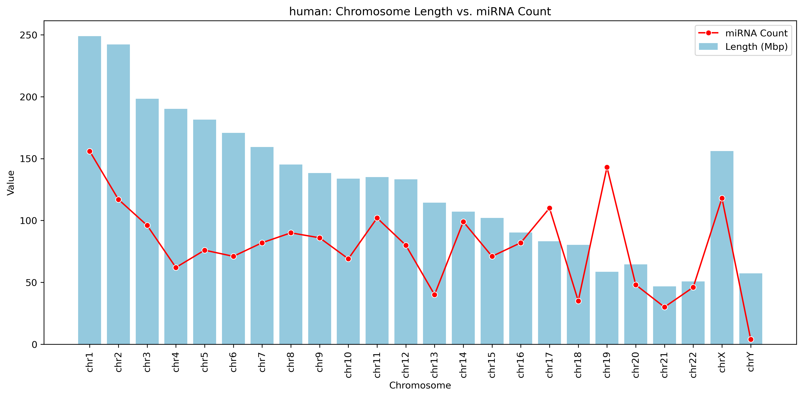
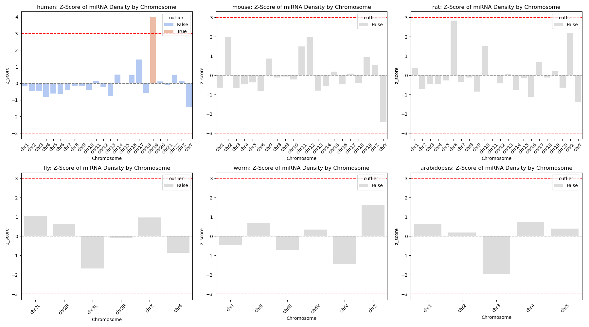

# miRNA Chromosome Distribution Analysis

This project analyzes the distribution of microRNAs (miRNAs) across chromosomes in multiple organisms. The goal is to investigate whether miRNA distribution is proportional to chromosome size, or if certain chromosomes are enriched with miRNAs, and also to identify any pattern between organisms.

## Organisms Analyzed

- Human (*Homo sapiens*)
- Mouse (*Mus musculus*)
- Rat (*Rattus norvegicus*)
- Fruit Fly (*Drosophila melanogaster*)
- Worm (*Caenorhabditis elegans*)
- Arabidopsis (*Arabidopsis thaliana*)

## Project Objectives

- Determine the correlation between chromosome length and miRNA count.
- Test for normality in miRNA distributions using visual and statistical methods.
- Identify outlier chromosomes with unusually high or low miRNA densities.
- Visualize the relationship between chromosome size and miRNA count.
- Conduct a literature review to identify potential reasons for results.

## Summary of Findings
- Smaller chromosomes like chr19 had high miRNA density
- Distributions were generally non-normal...
- Outliers identified using z-scores...

## Data

The miRNA data for each organism was collected from miRBase, a database for miRNA. This data was prre-processed to obtain unique chromosomes in the data and the count of miRNAs for each chromosome. Data on chromosome size for each chromosome in each organism was collected from NCBI. 
The final pre-processed data includes:
- Chromosome name/number
- Chromosome length (in base pairs)
- Number of miRNAs in each chromosome

Data is stored in an Excel file with each organism on a separate sheet.

## Methods

- **Normalization**: Chromosome lengths converted from base pairs to megabase pairs (Mbp).
- **miRNA Density**: Calculated as `miRNA count / chromosome length (Mbp)`. Instead of using miRNA count, this is an important step as it takes the chromosome size into account. For example, a chromosome might have lesser miRNAs only because it is smaller, and might actually have a higher miRNA density.
- **Normality Tests**: Shapiro-Wilk, histogram, and Q-Q plot visualizations.
- **Outlier Detection**: Z-scores computed from miRNA density, with threshold `|z| > 2` or `|z| > 3`.

## Visualizations

- Bar and line plots comparing chromosome length vs miRNA count.
- Z-score bar plots to highlight outlier chromosomes, based on miRNA density.
- Plots are saved in the `images/` folder.

## Tools Used

- Python (Pandas, SciPy, Matplotlib, Seaborn)
- Jupyter Notebook
- Bash
- Linux (WSL)
- Git / GitHub
- Excel

## Project Structure

```
├── README.md
├── data
│   ├── data.xlsx
│   └── raw_mirna_data.xlsx
├── images
│   ├── all_histograms.png
│   ├── all_organisms_comparison.png
│   ├── all_qqplots.png
│   ├── all_zscore_plots.png
│   ├── arabidopsis_comparison.png
│   ├── arabidopsis_zscore_plot.png
│   ├── fly_comparison.png
│   ├── fly_zscore_plot.png
│   ├── human_comparison.png
│   ├── human_zscore_plot.png
│   ├── mouse_comparison.png
│   ├── mouse_zscore_plot.png
│   ├── rat_comparison.png
│   ├── rat_zscore_plot.png
│   ├── worm_comparison.png
│   └── worm_zscore_plot.png
└── mirna_analysis.ipynb
```

## Getting Started

1. Clone the repo:
   ```bash
   git clone https://github.com/your-username/miRNA-Genomic-Distribution.git
   cd miRNA-Genomic-Distribution
2. (Optional) Create and activate conda environment:
   ```bash
   conda env create -f environment.yml
   conda activate mirna-env
3. Run the analysis via notebook.

## Sample Plots
**Human Chromosome Length vs. miRNA Count**



**Z-score plot: Outliers**



## TODO
- Automate data download/scraping
- Add more species for comparative analysis
